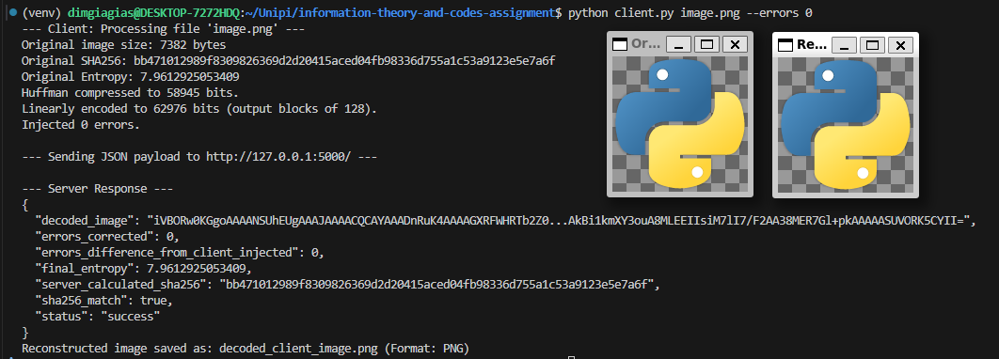

# Μετάδοση Εικόνας με Συμπίεση Huffman και Γραμμική Κωδικοποίηση Διόρθωσης Σφαλμάτων

Αυτή η εργασία επιδεικνύει μια εφαρμογή client-server για την επεξεργασία και μετάδοση αρχείων εικόνας. Ο client συμπιέζει μια εικόνα χρησιμοποιώντας κωδικοποίηση Huffman, προσθέτει padding, εφαρμόζει έναν γραμμικό κώδικα διόρθωσης σφαλμάτων, εισάγει σφάλματα και την στέλνει στον server. Ο server στη συνέχεια προσπαθεί να αποκωδικοποιήσει το μήνυμα, να διορθώσει σφάλματα, να αποσυμπιέσει την εικόνα και να επαληθεύσει την ακεραιότητά της.

---

### **Μέλη Ομάδας**
- Γιαγιάς Δημήτριος p21018

### **Αρχεία**:

*   **`client.py`**: Εκτελεί την εφαρμογή client.
*   **`server.py`**: Εκτελεί την εφαρμογή server.
*   **`utils.py`**: Περιέχει βοηθητικές συναρτήσεις για λειτουργίες αρχείων, έλεγχο τύπου MIME, υπολογισμό SHA256/εντροπίας, padding PKCS#7, εισαγωγή σφαλμάτων και μετατροπές δεδομένων (bits/bytes, Base64).
*   **`huffman.py`**: Υλοποιεί συμπίεση και αποσυμπίεση Huffman.
*   **`linear.py`**: Υλοποιεί ένα γραμμικό κώδικα (εκτεταμένο Κώδικα Hamming (128, 120)) για κωδικοποίηση και αποκωδικοποίηση διόρθωσης σφαλμάτων.
*   **`requirements.txt`**: Παραθέτει τις εξαρτήσεις Python της εφαρμογής.
*   **`setup.sh`**: Ένα shell script για τη ρύθμιση του εικονικού περιβάλλοντος Python και την εγκατάσταση των εξαρτήσεων.

---

### Εξαρτήσεις:

*   Python 3.x
*   Τα πακέτα Python που αναφέρονται στο `requirements.txt` (Flask, NumPy, python-magic, Requests).
*   **Εξάρτηση Συστήματος για το `python-magic`:** Η βιβλιοθήκη `python-magic` απαιτεί την εγκατάσταση της βιβλιοθήκης `libmagic` στο σύστημά σας.
    *   **Σε Debian/Ubuntu:** `sudo apt-get update && sudo apt-get install -y libmagic1`
    *   **Σε macOS (με χρήση Homebrew):** `brew install libmagic`
    *   **Σε Windows:** Για την εγκατάσταση της `libmagic` σε Windows, αναζητήστε τις κατάλληλες οδηγίες για το σύστημά σας. Συχνά απαιτείται η διαθεσιμότητα του αρχείου `magic.dll`.

---

### Ρύθμιση και Εκτέλεση:

1.  **Εγκατάσταση Εξαρτήσεων Συστήματος:**
    *   Βεβαιωθείτε ότι η `libmagic` είναι εγκατεστημένη στο σύστημά σας σύμφωνα με τις παραπάνω οδηγίες, εάν δεν την έχετε ήδη.

2.  **Ρύθμιση του Περιβάλλοντος Python (Προτείνεται):**
    *   Κάντε το script εγκατάστασης εκτελέσιμο: `chmod +x setup.sh`
    *   Εκτελέστε το script: `./setup.sh`
    *   Αυτό θα δημιουργήσει ένα εικονικό περιβάλλον με όνομα `venv`, θα το ενεργοποιήσει και θα εγκαταστήσει τις εξαρτήσεις από το `requirements.txt`.
    *   Εάν δεν χρησιμοποιήσετε το script, οι εξαρτήσεις μπορούν να εγκατασταθούν εκτελόντας `pip install -r requirements.txt`.

3.  **Εκκίνηση του Server:**
    *   Εκτελέστε τον server σε ένα terminal:
        ```bash
        python3 server.py
        ```
    *   Ο server θα ξεκινήσει και θα περιμένει αιτήματα, στη διεύθυνση `http://localhost:5000/`.

4.  **Εκτέλεση του Client:**
    *   Ανοίξτε ένα νέο terminal.
    *   Εκτελέστε το script του client, παρέχοντας τη διαδρομή προς ένα αρχείο εικόνας και το επιθυμητό ποσοστό σφάλματος:
        ```bash
        python3 client.py <διαδρομή_προς_την_εικόνα> --errors <ποσοστό σφάλματος>
        ```
    *   Παράδειγμα:
        ```bash
        python3 client.py my_photo.png --errors 5.0
        ```
        Αυτό θα προσπαθήσει να εισάγει 5.0% σφάλματα.

---

### Επισκόπηση Διαδικασίας:

**Client:**
1.  Διαβάζει ένα αρχείο εικόνας και επαληθεύει τον τύπο MIME του.
2.  Υπολογίζει το SHA256 hash και την εντροπία της αρχικής εικόνας.
3.  Συμπιέζει τα δεδομένα της εικόνας χρησιμοποιώντας κωδικοποίηση Huffman.
4.  Προσθέτει padding στη συμπιεσμένη ακολουθία bits χρησιμοποιώντας λογική PKCS#7 για να την προετοιμάσει για τον γραμμικό κωδικοποιητή.
5.  Κωδικοποιεί τα δεδομένα με padding χρησιμοποιώντας τον εκτεταμένο κώδικα Hamming(128,120) παράγοντας μπλοκ των 128-bit.
6.  Εισάγει ένα καθορισμένο από τον χρήστη ποσοστό τυχαίων σφαλμάτων bit στα γραμμικά κωδικοποιημένα δεδομένα.
7.  Μετατρέπει τα τελικά δεδομένα σε Base64.
8.  Στέλνει ένα JSON payload στον server που περιέχει το μήνυμα Base64, λεπτομέρειες συμπίεσης/κωδικοποίησης, παραμέτρους, πλήθος σφαλμάτων, αρχικό SHA256 και αρχική εντροπία.

**Server:**
1.  Λαμβάνει το JSON payload.
2.  Αποκωδικοποιεί το μήνυμα Base64.
3.  Πραγματοποιεί γραμμική αποκωδικοποίηση, προσπαθώντας να διορθώσει μοναδικά σφάλματα bit σε κάθε μπλοκ των 128-bit. Καταμετρά τον αριθμό των διορθωμένων σφαλμάτων.
4.  Αφαιρεί το padding PKCS#7.
5.  Αποσυμπιέζει τα δεδομένα χρησιμοποιώντας τον πίνακα συχνοτήτων Huffman.
6.  Υπολογίζει το SHA256 hash των ανακατασκευασμένων δεδομένων εικόνας και το συγκρίνει με το αρχικό hash που έστειλε ο client.
7.  Υπολογίζει την εντροπία των ανακατασκευασμένων δεδομένων εικόνας.
8.  Επιστρέφει μια JSON απάντηση στον client με τα αποτελέσματα της επεξεργασίας, συμπεριλαμβανομένων των διορθωμένων σφαλμάτων, της κατάστασης αντιστοίχισης hash και των τιμών εντροπίας.

---

### Screenshots Εκτέλεσης:


- Παράδειγμα εκκίνησης του server.


- Παράδειγμα εκτέλεσης του client.



Όπως φαίνεται στο τελευταίο παράδειγμα, αν προκληθούν σφάλματα στο header μιας εικόνας και δεν διορθωθούν όλα κατά την αποκωδικοποίηση (όπως συνέβη στην πρώτη εκτέλεση), τότε η εικόνα δεν μπορεί να ανακατασκευαστεί σωστά. Επιπλέον, λόγω της ευαισθησίας των μορφών αρχείων εικόνας, ακόμη και λίγα σφάλματα μπορεί να οδηγήσουν σε σημαντικές αλλοιώσεις κατά την ανασύνθεση της εικόνας από τον server.
